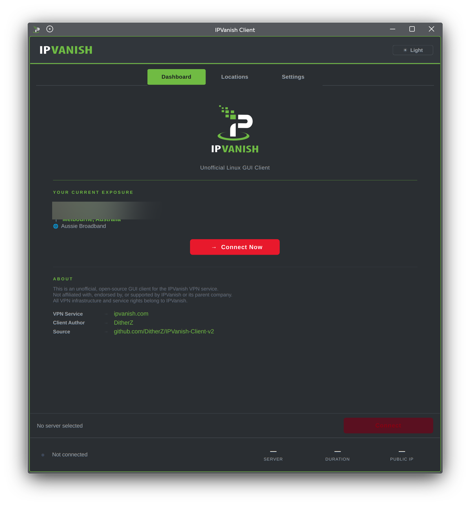
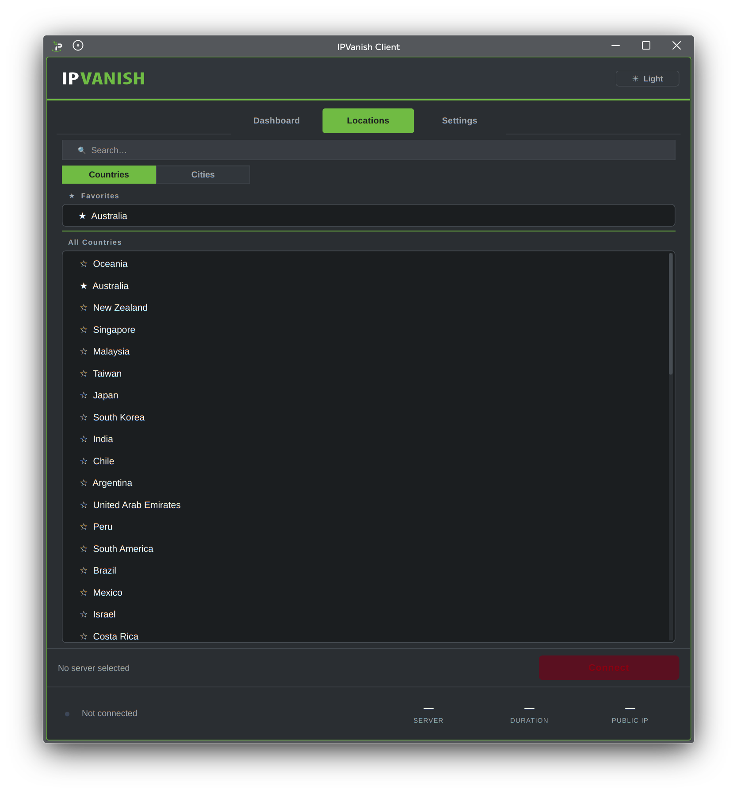
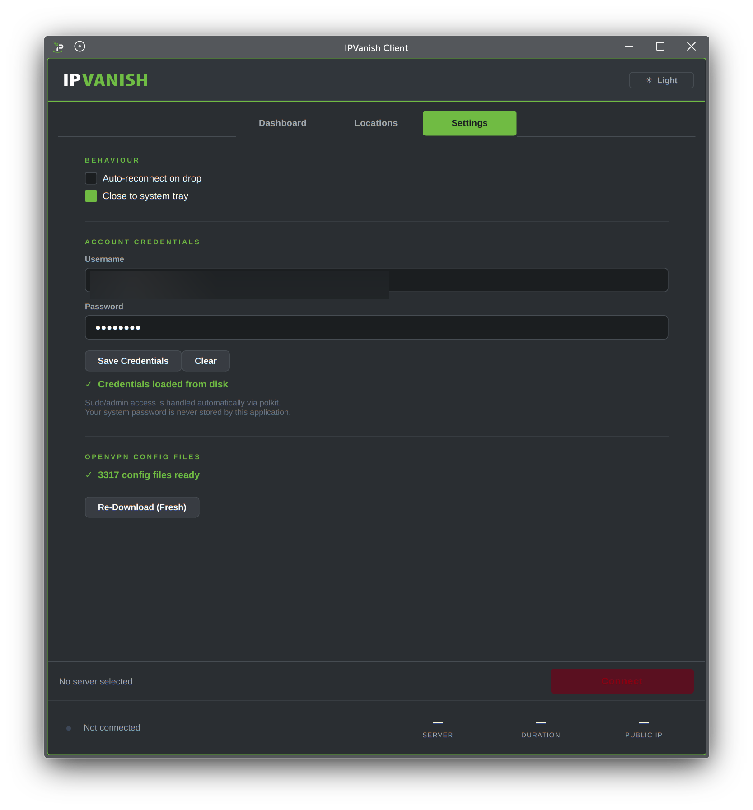

<div align="center">


<br />

# IPVanish Client

**Unofficial open-source Linux GUI client for the IPVanish VPN service**

[](https://python.org)
[](https://pypi.org/project/PyQt6/)
[](LICENSE)
[-orange?style=flat-square&logo=linux&logoColor=white)](https://github.com/DitherZ/IPVanish-Client-v2)
[](https://github.com/DitherZ/IPVanish-Client-v2)

> Not affiliated with, endorsed by, or supported by IPVanish or its parent company.  
> All VPN infrastructure and service rights belong to IPVanish.

</div>

---

## Screenshots

<div align="center">

| Dashboard | Locations | Settings |
|:---------:|:---------:|:--------:|
|  |  |  |

</div>

---

## Features

| | Feature | Description |
|---|---|---|
| | **Dashboard** | Live public IP, geo-location (city / country / ISP), one-click connect |
| | **Locations** | ~3,300 servers sorted nearest-first via haversine geo-sort; pill switcher for Countries / Cities; pinned Favourites; real-time search |
| | **Universal Protocol** | OpenVPN `.ovpn` and WireGuard `.conf` profiles — not just IPVanish servers; imported profiles shown with `[OVP]` / `[WG]` badges |
| | **System Tray** | Live upload/download speed, public IP tooltip; Connect/Disconnect from right-click menu; close-to-tray |
| | **Dual Theme** | Dark (Klassy Dark) and Light (Clean) — switchable at runtime without restart |
| | **Polkit / pkexec** | All privileged operations run via `pkexec`; your system password is never stored |
| | **Split Tunnel** | Per-CIDR exemptions bypass the VPN tunnel via local gateway |
| | **Auto-Reconnect** | Optional QTimer polling reconnects the tunnel if it drops |
| | **Single Instance** | `QLockFile` guard — second launch raises the existing window |
| | **Favourites** | Star any server; persisted to `~/.config/ipvanish-client/favorites.json` |

---

## Quick Install

One-liner for Debian / Ubuntu / Mint / Parrot OS and derivatives:

```bash
bash <(curl -fsSL https://raw.githubusercontent.com/DitherZ/IPVanish-Client-v2/main/linux_install.sh)
```

Or with `wget`:

```bash
bash <(wget -qO- https://raw.githubusercontent.com/DitherZ/IPVanish-Client-v2/main/linux_install.sh)
```

The installer will:
- Install system dependencies (`openvpn`, `policykit-1`)
- Install Python dependencies (`PyQt6`, `requests`, `beautifulsoup4`)
- Clone the repo to `~/.local/share/ipvanish-client`
- Symlink `ipvanish` to `/usr/local/bin`
- Install the app icon and `.desktop` entry
- Apply secure permissions to `config/`

---

## Manual Installation

### 1 — Clone

```bash
git clone https://github.com/DitherZ/IPVanish-Client-v2.git
cd IPVanish-Client-v2
```

### 2 — System dependencies

```bash
sudo apt install openvpn policykit-1
# WireGuard profiles (optional):
sudo apt install wireguard-tools
```

### 3 — Python dependencies

```bash
pip install PyQt6 PyQt6-Qt6 requests beautifulsoup4
# or:
pip install -e .
```

### 4 — Run

```bash
./ipvanish
```

---

## Requirements

| Dependency | Version | Notes |
|---|---|---|
| Python | ≥ 3.11 | |
| PyQt6 | ≥ 6.6.0 | |
| PyQt6-Qt6 | ≥ 6.6.0 | |
| requests | ≥ 2.31.0 | |
| beautifulsoup4 | ≥ 4.12.0 | |
| openvpn | system | Required for OpenVPN connections |
| wireguard-tools | system | Optional — WireGuard profiles only |
| polkit / pkexec | system | Required for privileged operations |

---

## First-Time Setup

1. **Credentials** — Settings → Account Credentials → enter your IPVanish email and password → Save
2. **Download configs** — Settings → OpenVPN Config Files → Download Config Files (~3,300 profiles)
3. **Pick a server** — Locations tab → choose a country or city → double-click to select
4. **Connect** — click **Connect** in the bottom bar; Polkit will prompt for your system password once

---

## Project Structure

```
IPVanish-Client-v2/
├── core/
│   ├── backends/
│   │   ├── base.py              # VPNBackend ABC
│   │   ├── openvpn_backend.py   # OpenVPN process lifecycle
│   │   └── wireguard_backend.py # WireGuard via wg-quick
│   ├── config_parser.py         # Selects & writes conn.ovpn
│   ├── connection.py            # ConnectionManager — pkexec orchestration
│   ├── downloader.py            # Threaded config downloader
│   ├── favorites.py             # JSON-persisted favourites store
│   ├── geo.py                   # ip-api.com lookup, haversine sort
│   ├── profiles.py              # ProfileStore — unified OpenVPN + WireGuard
│   ├── servers.py               # Country/city lists + region maps
│   └── tunnel_monitor.py        # /proc/net/dev speed monitor
│
├── ui/
│   ├── main_window.py           # QMainWindow — tabs, tray, theme engine
│   ├── theme.qss                # Active QSS stylesheet (dark default)
│   ├── themes/
│   │   ├── dark.qss             # Klassy Dark theme
│   │   └── light.qss            # Clean Light theme
│   └── widgets/
│       ├── dashboard.py         # IP, location, connect now
│       ├── server_list.py       # LocationsWidget — pill switcher, geo sort
│       ├── status_panel.py      # Bottom stats bar
│       ├── credentials_tab.py
│       └── configs_tab.py
│
├── assets/
│   ├── SVG/                     # IPVanish press kit SVG logos
│   ├── PNG/                     # App icon (512×512, 64×64)
│   └── screenshots/             # GUI screenshots
│
├── config/                      # Runtime directory — gitignored
│   ├── ca.ipvanish.com.crt      # CA certificate (shipped)
│   ├── credentials              # Your credentials — gitignored, never committed
│   └── *.ovpn                   # Downloaded server configs — gitignored
│
├── daemon/
│   ├── ipvanish-widget-daemon.py    # KDE Plasma widget daemon
│   └── ipvanish-widget-daemon.service
│
├── plasmoid/
│   ├── com.ditherz.ipvanish/        # KDE Plasma 6 plasmoid
│   └── install-widget.sh            # Plasmoid installer
│
├── tools/
│   └── vpn_benchmark.py         # Standalone OpenVPN speed benchmark CLI
│
├── docs/
│   └── themes.txt               # QSS theme reference / colour notes
│
├── tests/
│   ├── test_backends.py
│   ├── test_daemon.py
│   └── test_profiles.py
│
├── ipvanish                     # Entry point (chmod +x)
├── linux_install.sh             # One-shot Debian installer
├── IPVanish.desktop             # XDG desktop entry
├── pyproject.toml
└── requirements.txt
```

---

## Security Notes

- **Credentials** — stored in plaintext at `config/credentials` (required by OpenVPN's `auth-user-pass` directive). The installer sets `chmod 700 config/` and `chmod 600 config/credentials` automatically.
- **System password** — never handled, stored, or seen by this application. All privileged operations are delegated to `pkexec`, which invokes polkit's native authentication dialog.
- **IPv6** — disabled during VPN sessions (`net.ipv6.conf.all.disable_ipv6=1`) and restored on disconnect.
- **DNS** — routed exclusively through IPVanish resolvers (`198.18.0.1`, `198.18.0.2`) for the duration of the connection; original `/etc/resolv.conf` is backed up and restored on disconnect.

---

## Disclaimer

This project is an independent, community-developed tool. It is in no way affiliated with, officially connected to, or endorsed by IPVanish, Ziff Davis, or any of their affiliates. The IPVanish name, logo, and branding are trademarks of their respective owners and are used here solely for identification purposes under nominative fair use.

Use of this client requires a valid [IPVanish subscription](https://www.ipvanish.com/). The VPN service, server infrastructure, and all related intellectual property belong to IPVanish.

---

## Author

**DitherZ** — [github.com/DitherZ](https://github.com/DitherZ)

---

## License

[MIT License](LICENSE)
